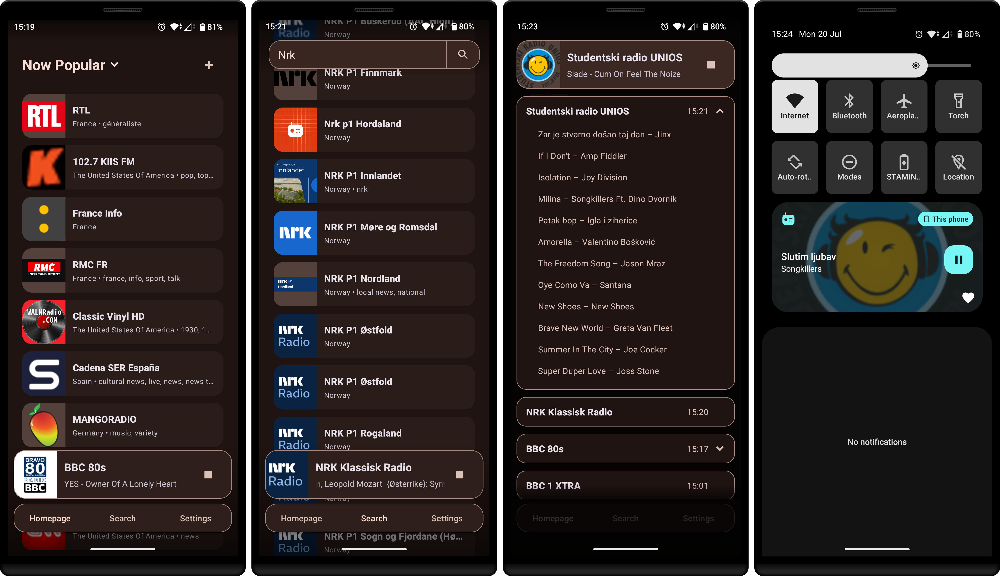

# FreeAir Radio

   

FreeAir Radio is an Android internet radio client. It uses [*radio-browser*](https://www.radio-browser.info/) for station discovery.

The project started as a university Android course app. It's influenced partly by [*Shortwave*](https://apps.gnome.org/Shortwave/) and [*PowerAmp*](https://powerampapp.com/).

## Screenshots

## Current Features

- Browse and search internet radio stations from Radio Browser
- Play radio streams through Media3, designed to support Android’s
  system media and Android Auto
- Show now-playing metadata when the stream provides it
- Save favorites, local stations, and recently played history

## Status

FreeAir Radio is currently in beta. Core browsing, playback, persistence, metadata handling, audio focus handling and notification features are in place.

### What's planned

- shake-to-random station loading
- tablet layouts
- recording-related features

## Notes

- Metadata support depends on the station stream. Some stations provide no usable now-playing data.
- FreeAir Radio is not affiliated with Radio Browser or with the radio stations listed through it.
- Some station stream URLs, logos, and metadata can change or disappear without notice.

## License

This project is licensed under the GPLv3 License - see the [LICENSE](LICENSE) file for details.
